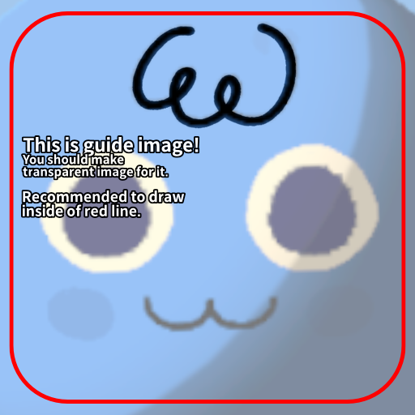

# Accessory

Accessory is usually expresses hair, eyeglasses, etc.

1. Create `1:1` ratio transparent image. (`512` pixels are recommended)
2. Take guideline image into layer for guide.

3. Draw anything you want to be!
4. Hide guide image and save to png file.
5. [Now you are ready to build asset bundle!](./build-asset-bundle.md)
