# Build asset bundle

In order to load customization with this mod, you need empty project that can produce customization files.

## Create customization asset bundle from Unity

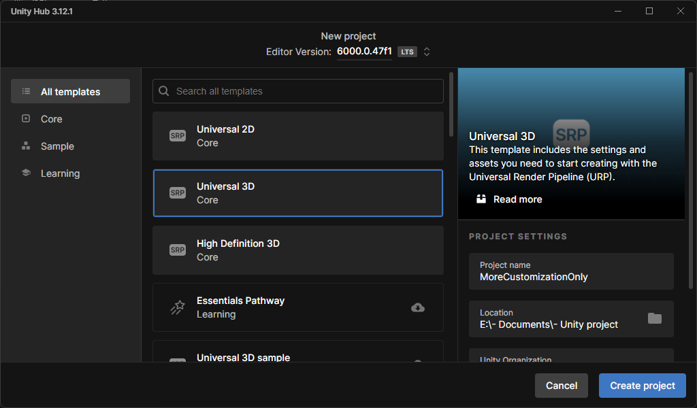

1. Create new 'Universal 3D' project.

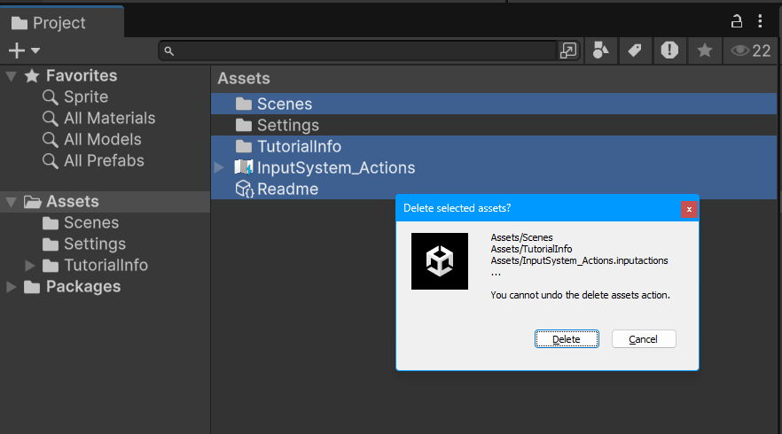

2. Delete all pre made asset files except `Settings`.

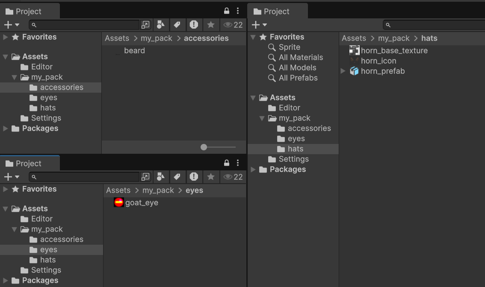

1. Create directory you want to pack assets, and import assets to your directory.

I'd recommend to separate them by each customization types for organization purposes.
- `accessories`
- `eyes`
- `mouths`
- `hats`

### Important!

Asset bundle only can have lower cases so you should use `snake_case` convention for these assets.

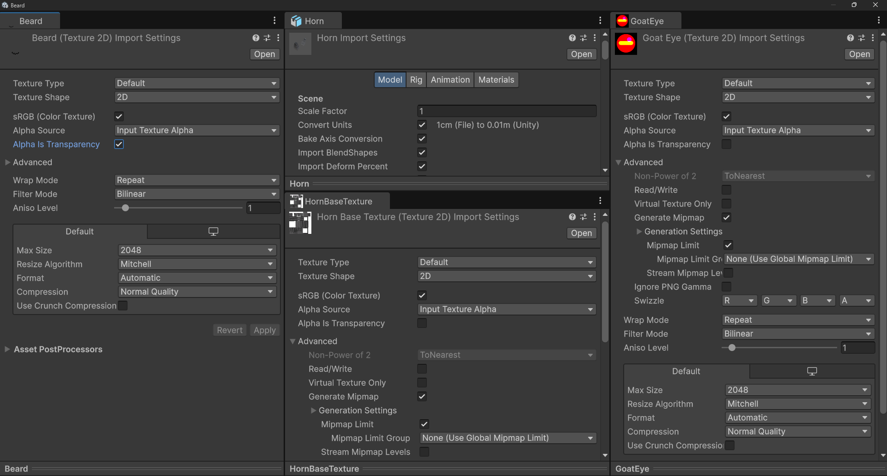

4. Setup imported assets for each customization types.  
   You should change import settings of your assets.  
   Click asset will make inspector shows it's import settings.
   - Accessory, Mouth
     - Check 'Alpha is Transparency'
     - Uncheck 'Generate Mipmap' in 'Advanced' foldout
     - Set Wrap Mode to 'Clamp'
   - Eye
     - Uncheck 'Alpha is Transparency'
     - Uncheck 'Generate Mipmap' in 'Advanced' foldout
     - Set Wrap Mode to 'Clamp'
     - Set Compression to 'High Quality' or 'None'
   - Hat
     - For model(fbx)
       - In 'Model' tab, check 'Bake Axis Conversion'
     - For textures
       - Uncheck 'Alpha is Transparency'

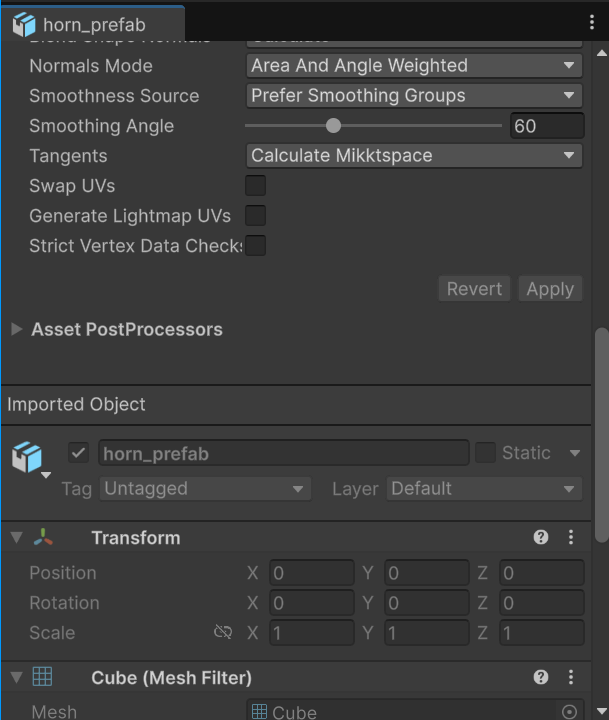

For model, you should check imported prefab's transform.

You can find it easily by scroll down of model import settings.

It should has default transform values. (All zero, one scale)

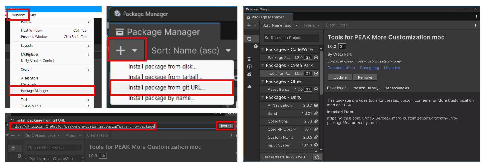

5. Install tools for building asset bundle

Open 'Window' at the top menu and find 'Package Manager'.

When Package Manager window shows, press `+` at the top left corner
and choose 'Install package from git URL...' will shows input form.

Paste below URL to form and click 'Install' at right corner will install tool package.

```
https://github.com/Creta5164/peak-more-customizations.git?path=unity-package
```

This tool will help to build your customization content!

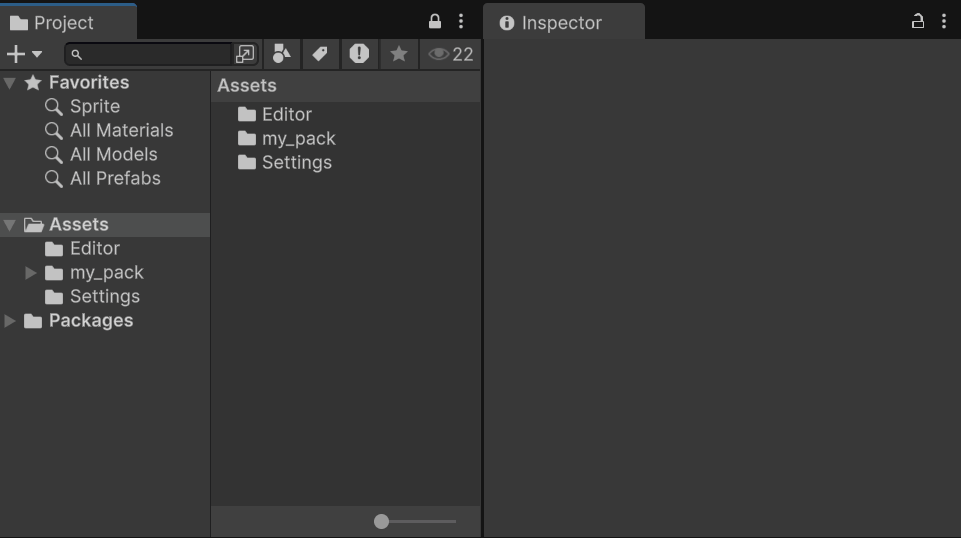

6. Create actual customization data asset!

You should create customization data asset so mod can determine which asset is made for customization.

In empty area of project tab, right click and navigate
`Create/PEAK More Customizations` to see available customization options.

Select you want to make will create data asset to same directory.

Click it will shows input forms on inspector,
now you should fill these form for customization.

- Accessory, Eye, Mouth
  - Texture is required.
- Hat
  - Icon, Prefab, Main Texture are required.
  - Use sub texture if your model has secondary material.
  - Position/Euler angle offset is for adjusting place in game.

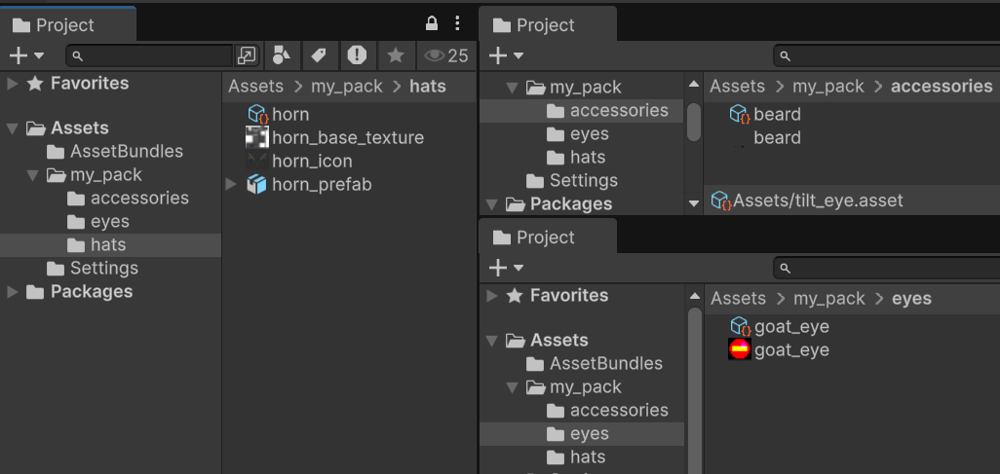

If you finished to do it, result will looks like this.

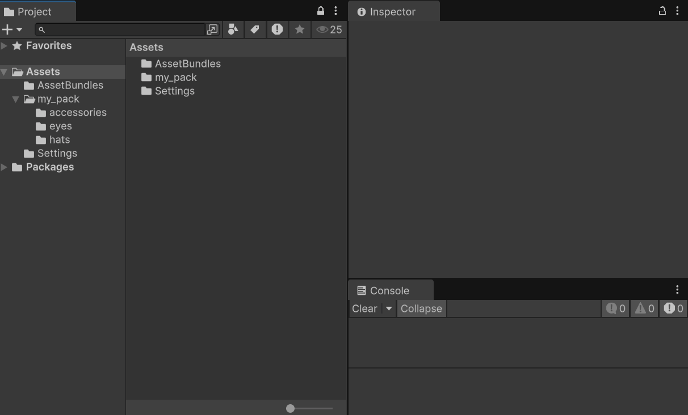

7. Configure export asset bundle.

In project tab, click your directory makes inspector shows information.

At the bottom, you can see 'AssetBundle' option.

First dropdown is what file name is, and second dropdown is what file extension is.

Add or select first dropdown to what you to do.

Second dropdown is must be `pcab`, mod will only load this extension.

> It stands for 'PEAK Custom(ization) Asset Bundle'.

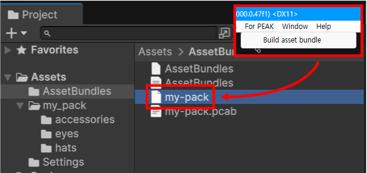

8. Run 'For PEAK/Build asset bundle' at top of window.  
   This will produce asset bundle file to `Assets/AssetBundles`
   as you named asset bundle name.

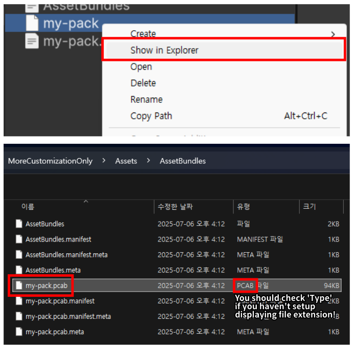

You can grab builded file by right click to 'Show in Explorer'.

Note that you should take `<your_asset_bundle_name>.pcab` file!

Place this file anywhere in the `plugins` folder of `BepInEx` to finish it!  
The mod will recognize and load your customization file.

To share your customization file, you can include it in your ThunderStore and publish it!
