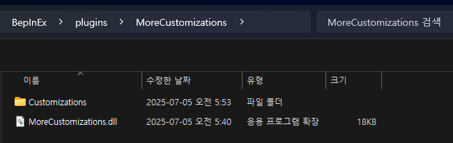
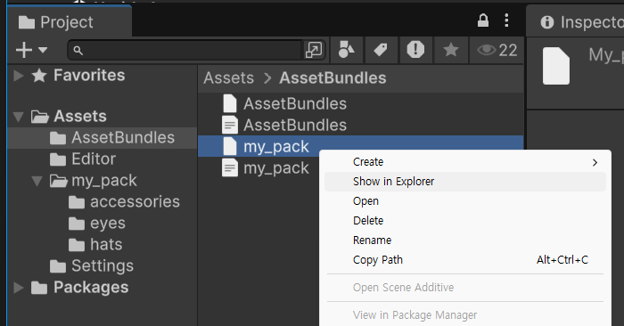
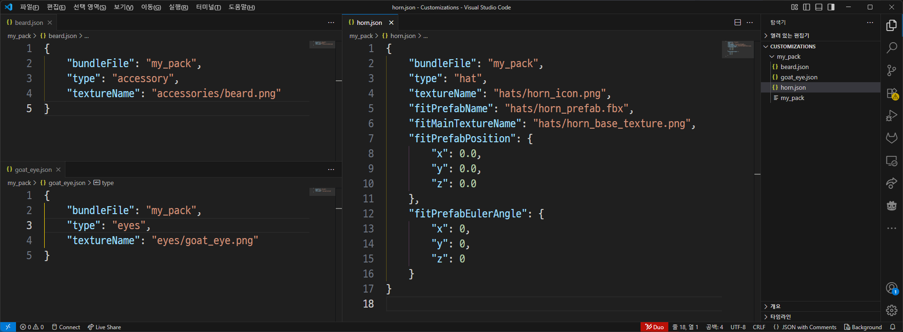

# Create customization



Find your BepInEx's plugin directory.

If you have run once while MoreCustomizations installed,
there'll be `Customizations` directory in `MoreCustomizations` directory.

If not, just create directory with same name.




1. Create directory that you want to put customizations together.  
   Copy your created asset bundle file from Unity to put here.  
   You can grab asset bundle file by right click to file in project panel.



2. Now it's time to fill out your customization information.

The customization information consists of text files in JSON format,
and you need to write one file per customization.

Some properties require you to enter the file paths
that you configured in Unity to load from the Asset bundle you created.

This mod does some processing to make the path concise,
so if you created an Asset bundle with the following path...

```
Assets/my_pack/eyes/goat_eye.png
```

Then you should use it like below.

```
eyes/goat_eye.png
```

In example, if you want use `Assets/my_pack/eyes/goat_eye.png`,

Note that you can jump to bottom for examples.

### JSON properties

<table>
    <tr>
        <th>Property name</th>
        <th>Description</th>
    </tr>
    <tr>
        <td><code>bundleFile</code></td>
        <td>
            The path that contains the asset bundle that this customization wants to use.<br/>
            The path starts with the path relative to where the customization JSON file is located.
        </td>
    </tr>
    <tr>
        <td><code>type</code></td>
        <td>
            Represents the type of customization, available options are below.
            <ul>
                <li><code>accessory</code></li>
                <li><code>eyes</code></li>
                <li><code>mouth</code></li>
                <li><code>hat</code></li>
            </ul>
        </td>
    </tr>
    <tr>
        <td><code>textureName</code></td>
        <td>
            A base texture that has different uses depending on <code>type</code>.<br/>
            Should be represent asset bundle path from bundle root path.
            <ul>
                <li>
                <code>accessory</code>, <code>eyes</code>, <code>mouth</code>
                will use both passport icon and actual face texture.
                </li>
                <li>
                <code>hat</code> will use only for passport icon.
                </li>
            </ul>
        </td>
    </tr>
    <tr>
        <td>
            <code>fitPrefabName</code><br/>
            (Required if <code>type</code> is <code>hat</code>)
        </td>
        <td>
            A prefab to create for a hat when <code>type</code> is <code>hat</code>.<br/>
            Should be represent asset bundle path from bundle root path.
        </td>
    </tr>
    <tr>
        <td>
            <code>fitMainTextureName</code><br/>
            (Required if <code>type</code> is <code>hat</code>)
        </td>
        <td>
            The texture to use for the first material applied to <code>fitPrefabName</code>.
        </td>
    </tr>
    <tr>
        <td>
            <code>fitSubTextureName</code><br/>
            (Optional)
        </td>
        <td>
            The texture to use for the second material applied to <code>fitPrefabName</code>.
        </td>
    </tr>
    <tr>
        <td>
            <code>fitPrefabPosition</code><br/>
            (Optional)
        </td>
        <td>
            An additional local coordinate offset to adjust in-game
            when <code>fitPrefabName</code> is created.<br/>
            Since the coordinate system of the face is different in the actual game,
            this mode compensates for this so that you can intuitively adjust the coordinates.<br/>
            <ul>
                <li><code>x</code> : Number</li>
                <li><code>y</code> : Number</li>
                <li><code>z</code> : Number</li>
            </ul>
        </td>
    </tr>
    <tr>
        <td>
            <code>fitPrefabEulerAngle</code><br/>
            (Optional)
        </td>
        <td>
            An additional local euler angle offset to adjust in-game
            when <code>fitPrefabName</code> is created.<br/>
            Since the coordinate system of the face is different in the actual game,
            this mode compensates for this so that you can intuitively adjust the angle.
            <ul>
                <li><code>x</code> : Number</li>
                <li><code>y</code> : Number</li>
                <li><code>z</code> : Number</li>
            </ul>
        </td>
    </tr>
</table>

### Accessory, eye, mouth example

```json
{
    "bundleFile": "my_asset_bundle_file",
    "type": "accessory",
    "textureName": "accessories/glasses.png"
}
```

```json
{
    "bundleFile": "my_asset_bundle_file",
    "type": "eyes",
    "textureName": "eyes/goat_eye.png"
}
```

```json
{
    "bundleFile": "my_asset_bundle_file",
    "type": "mouth",
    "textureName": "mouths/bleh.png"
}
```

### Hat example

```json
{
    "bundleFile": "my_pack",
    "type": "hat",
    "textureName": "hats/horn_icon.png",
    "fitPrefabName": "hats/horn_prefab.fbx",
    "fitMainTextureName": "hats/horn_base_texture.png",
    "fitPrefabPosition": {
        "x": 0.0,
        "y": 0.0,
        "z": 0.0
    },
    "fitPrefabEulerAngle": {
        "x": 0.0,
        "y": 0.0,
        "z": 0.0
    }
}
```