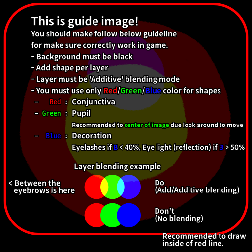
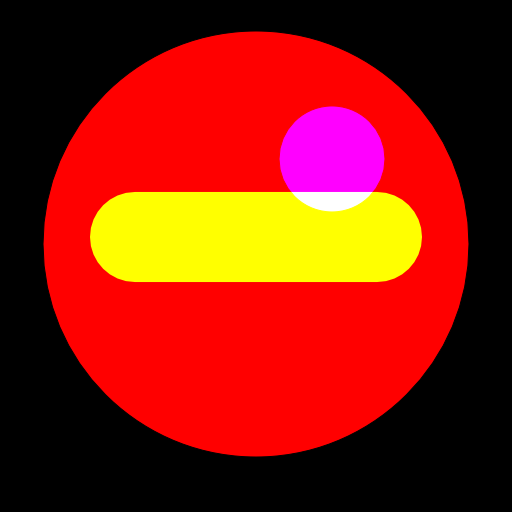
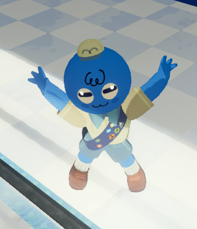

# Eyes

The is probably tricky for non-technical artists, but stick with this!

1. Create `1:1` ratio black background image. (`512` pixels are recommended)
2. Take guideline image into layer for guide.

3. Eye image is supposed to represent red, green, and blue as the parts of the eye.
   - Red is conjunctiva (white color of eye)
   - Green is pupil (black color of eye)
     - **Recommended to place center of image**.
     - Only this part will move around for looking direction.
     - If green value are going to less it will be blue color of pupil.
   - Blue is decoration
     - If blue is over `50%`, it'll be **reflection of eye**. (highlight)
     - If less then `40%`, it'll be **eyelashes**.
4. Normally, if you try to put them together, they will obscure each other.  
   You should combine them by using 'Add', 'Additive' as a blend option on the layer.   
   I recommend creating a shape layer for each part of the eye, and organizing them using layers per shape.

I can show you how I created the goat eyes below as an example, and result.

<table>
    <tr>
        <td>
            
        </td>
        <td>
            
        </td>
    </tr>
</table>

1. [Now you are ready to build asset bundle!](https://github.com/Creta5164/peak-more-customizations/tree/main/docs/build-asset-bundle.md)
