# Hat

This is an area where you can often wrestle with the Unity Editor.

The documentation is quite long,
to allow you to create hat customizations to a minimum standard.

*This guide is based on Blender (4.3).*

## If you want to skip entire basic stuff...

This guide follows a rough Blender basics.  
So if you're already familiar with it,
you only need to know the core information below
to create your own resources.

- This mod only allows 2 textures total.
  - Recommended to use `512x512`, `1024x1024` pixels.
- Requires passport menu icon's texture separately.
  - Recommended to use `128x128` pixels.
- `Y+` should be forward.
- Scout's head radius is approximately `1.415` units.
- World's origin point is center of scout's head.
- Recommended to export `.fbx`.

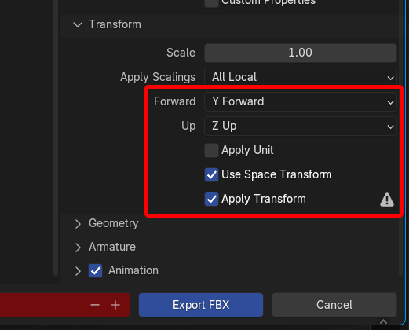
- When you export, open 'Transform' tab and apply below settings.
  - Forward : Y Forward
  - Up : Z Up
  - Uncheck 'Apply Unit'
  - Check 'Use Space Transform' and 'Apply Transform'
- Save textures to `.png` file if you made mapped to object.

[Now you are ready to build asset bundle!](https://github.com/Creta5164/peak-more-customizations/tree/main/docs/build-asset-bundle.md)

## Prepare scene in Blender

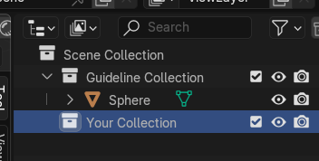

1. Create two collections, one is for guideline, and other one is for actual hat model.
   - I'd recommend to name them like below.
     - `Guideline Collection`
     - `Your Collection`

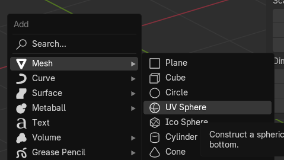

2. Select `Guideline Collection` and then create sphere object.  
   (Creating shortcut is <kbd>Shift</kbd> + <kbd>A</kbd> by default)

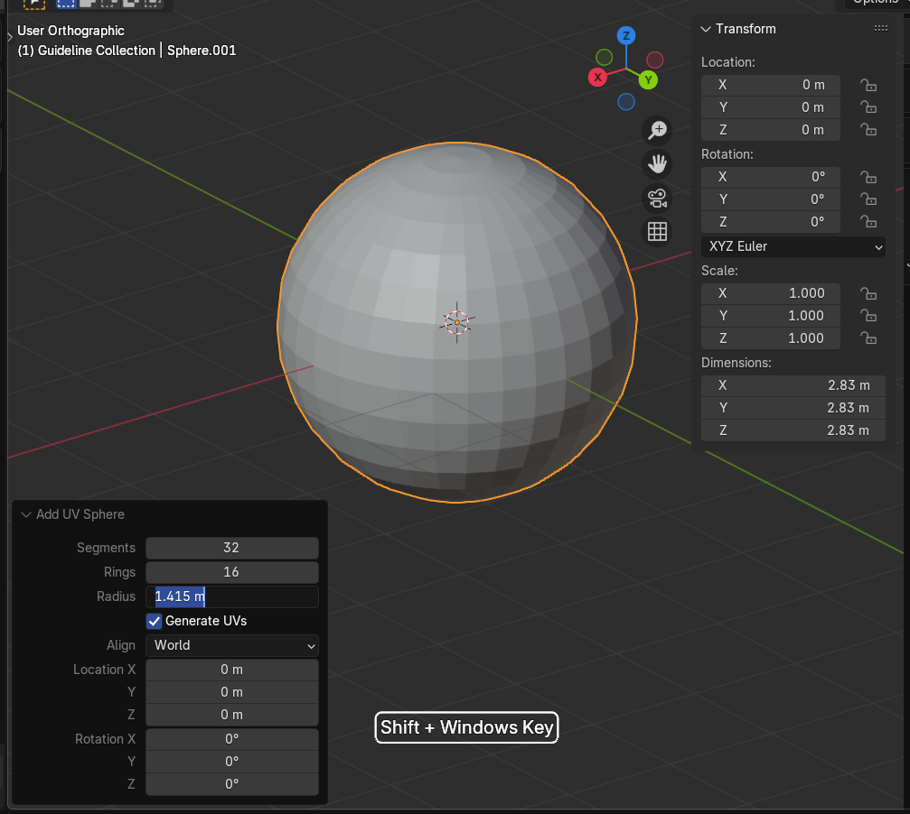

3. At bottom left corner, you can see `Add UV Sphere` option.  
   Click to open it and set `Radius` to `1.415`.  
   This is approximately radius of scout's head.

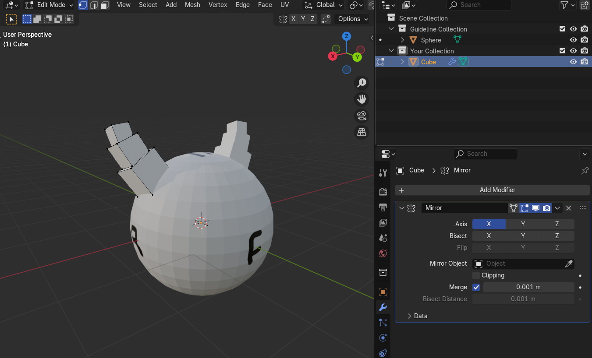

4. Now, you can do whatever you want to make own hat in `Your Collection`!

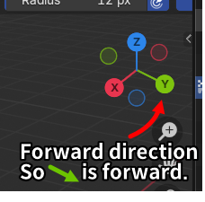

You can predicate forward direction by upper right side of this gizmo.

## Painting (texture)

Note that you can only use 2 textures total!

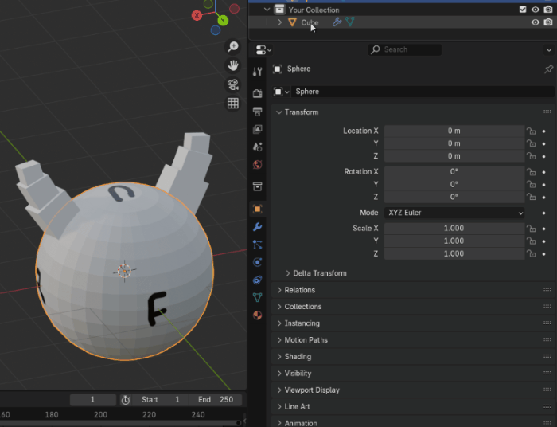

1. Create material you want to paint in desired object.  
   Recommended texture size is `512x512` pixels.

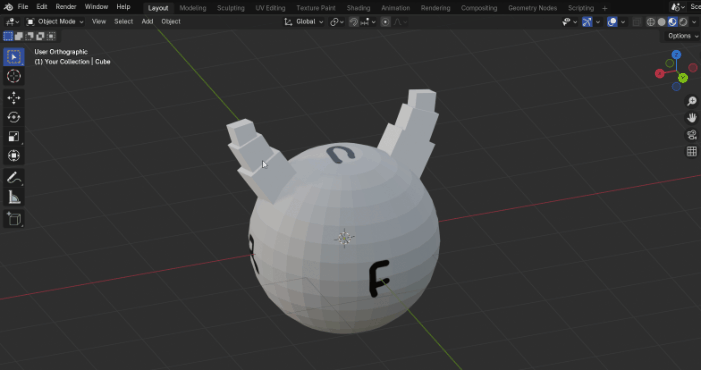

2. Go to `UV Editing` at top of layout menu.  
   Order to paint texture, you should unwrap UV of your object.

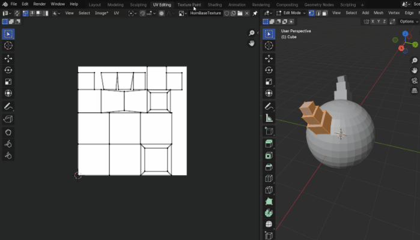

3. Now, go to `Texture Paint` at top of layout menu.  
   You can draw on object!

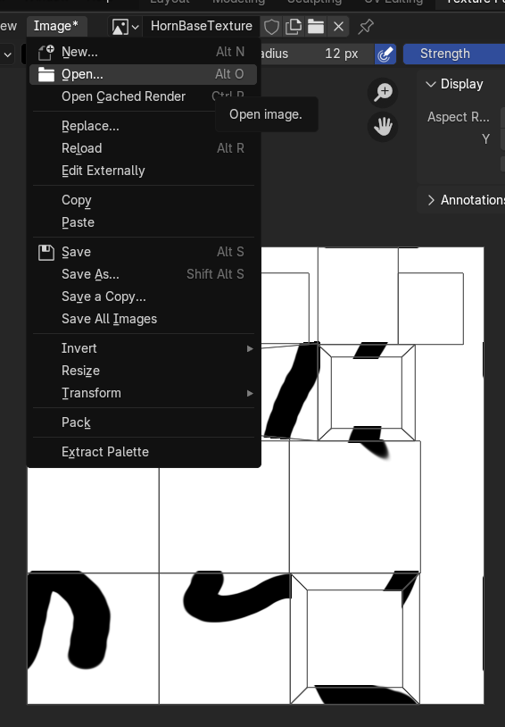

If you want to draw with your favorite image/drawing software,
You can import texture from 'Image/Open...' menu.

You can take a screenshot of the area where the mesh is drawn
in the Paint View on the left and use it as a guide
for texture mapping.

## Export

Let's prepare hat model for Unity.

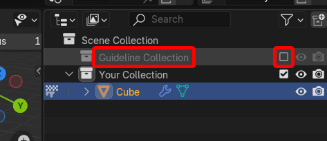

1. Before we export, go to scene hierarchy.  
   Press checkbox of `Guideline Collection` to exclude them.

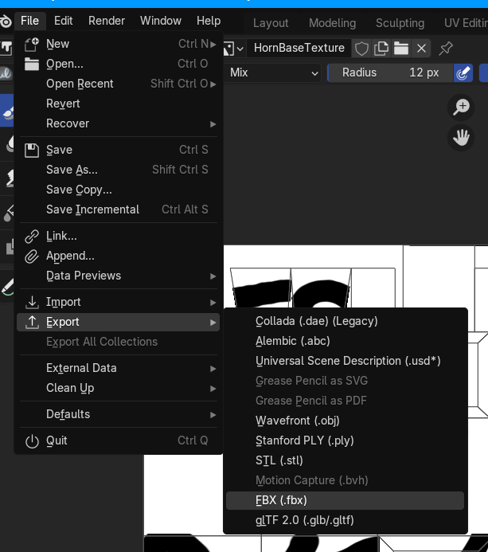

2. On the top, go to 'File/Export/FBX (.fbx)' menu.

3. When you export, open 'Transform' tab and apply below settings.
  - Forward : Y Forward
  - Up : Z Up
  - Uncheck 'Apply Unit'
  - Check 'Use Space Transform' and 'Apply Transform'

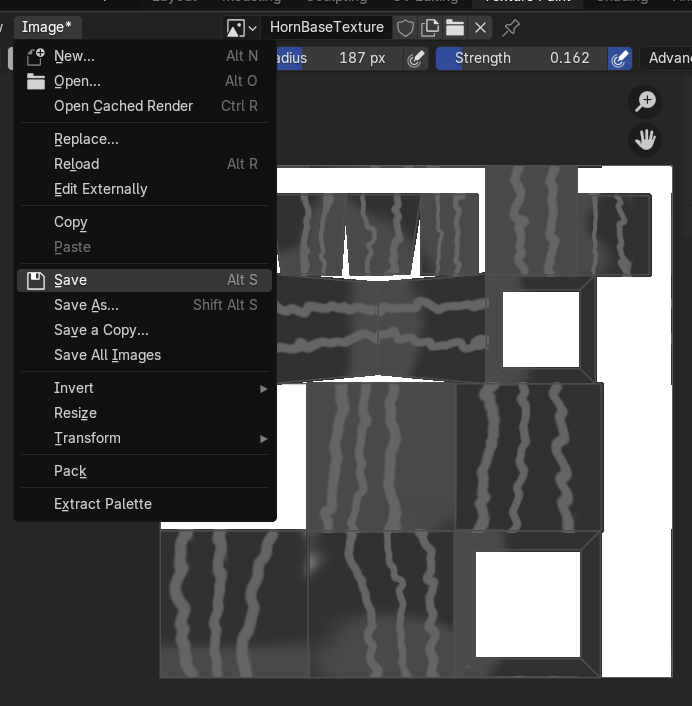

4. Lastly, export textures you've made.
   
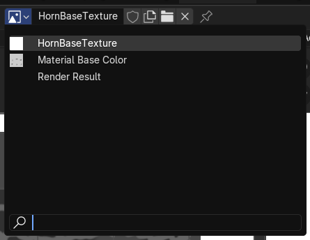

If you made more then one, You can find photo dropdown icon
at left side of texture name.

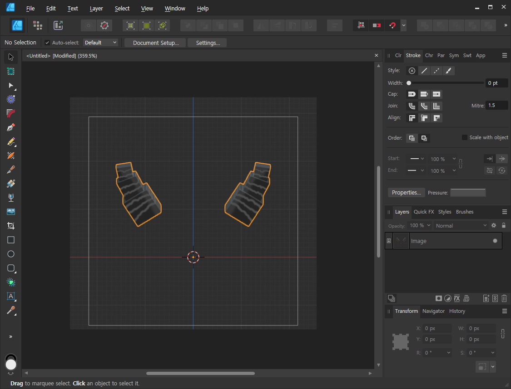

5. Make icon for it!  
   This is required for displaying in passport menu.
   - Recommended size is `128x128` pixels.
   

[Now you are ready to build asset bundle!](https://github.com/Creta5164/peak-more-customizations/tree/main/docs/build-asset-bundle.md)
